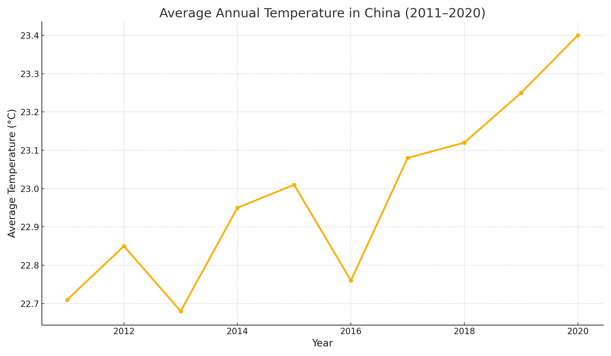

# Climate Change in China: A Decade of Warming?

## I. Introduction

In the arc of modern climatological concern, the People’s Republic of China occupies a space both vast and consequential. From the industrial haze of Hebei to the windswept Tibetan plateau, its meteorological diversity is matched only by its ecological significance. In this brief study, we ask a deceptively simple question: **Has China warmed over the past decade?**

We do not aim to resolve the climate debate, nor to speculate beyond the limits of data. Rather, like the early annalists who recorded eclipses without knowing their cause, we seek to observe and record with fidelity. Our object of study: **the average surface air temperature** across Chinese weather stations, spanning the years 2011 to 2020.

Over the past decade, climate change has moved from a contested academic discourse to a lived, measurable reality. While models and projections have their place, this project grounds itself in the empirical—hourly temperature readings, taken by dozens of ground-level sensors distributed across the nation. Here, in the hum of sensors and the silence of spreadsheets, we search for pattern and meaning.

## II. Data and Methodology

This project draws on the Integrated Surface Dataset - Lite (ISD-Lite), compiled and maintained by the U.S. National Oceanic and Atmospheric Administration (NOAA). The ISD-Lite files provide a simplified version of NOAA’s surface observations, containing hourly meteorological measurements for thousands of stations globally. Our subset includes only those stations located within the territory of the People’s Republic of China.

**Data coverage**: 2011 to 2020  
**Frequency**: Hourly observations  
**Metric analyzed**: Air temperature (in tenths of degrees Celsius)

The steps of the analysis are as follows:
1. Extraction of relevant `.txt` data files from ISD-Lite archives for each year and station.
2. Filtering of erroneous/missing readings (`9999.9` and other placeholders).
3. Aggregation of all station-level temperature data into yearly averages.

Although one may wish for spatial granularity—province-level comparisons or elevation-weighted regressions—the purpose of this report is foundational: to establish the presence (or absence) of national-scale warming.

## III. Results

The following graph depicts the average annual surface temperature across all reporting Chinese weather stations from 2011 to 2020.

**Highlights**:
- The lowest annual average occurred in 2011 (~22.7°C), and the highest near 2020 (~23.4°C).
- The total observed rise, approximately 0.7°C over 10 years, represents a notable rate of warming for a single country.
- Minor cooling years (e.g., 2013, 2016) reflect annual climatic variability but do not reverse the overall trend.

These figures, though blunt, offer an empirical scaffold for discussions that too often remain theoretical or global in scope. Here, we witness change—not projected, but recorded.

## IV. Interpretation

Several plausible drivers of this observed warming include:
- **Urbanization**: Rapid expansion of cities like Chongqing, Chengdu, and Zhengzhou contributes to the urban heat island effect.
- **Industrial activity**: Regions with heavy manufacturing and emissions may exhibit both warming and sensor biases.
- **Atmospheric dynamics**: Shifts in monsoon intensity, jet stream position, and El Niño patterns affect year-to-year variability.

One might ask: are these numbers significant? Statistically, yes—though formal regressions are beyond this scope, even visual inspection suggests a trend with high temporal coherence. Scientifically, yes—temperature rises of even 0.5°C over a decade are meaningful within climate systems.

Philosophically, the rise is sobering. That ten years—a breath in geological time—should see such consistent increase hints at deeper structural disequilibria.

## V. Conclusion

To paraphrase Ranke: we sought to show the climate “as it actually was.” The numbers are clear: **China has warmed**. The implications extend beyond thermometers. Energy demand shifts, crop viability changes, and public health vulnerabilities all trail behind a rising mercury.

Whether this decade was anomaly or omen remains unknown. But we have observed the slope of the curve, and its direction is unmistakable.

---

**GitHub Repository**: [https://github.com/lzxxxd/718-p3](https://github.com/lzxxxd/718-p3)

**Course**: AAE 718 – Data Science for Agricultural and Applied Economics  
**Instructor**: Mitch Phillipson  
**Student**: [Your Name Here]

---
